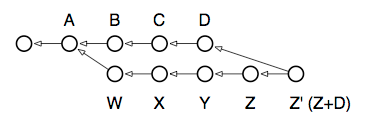
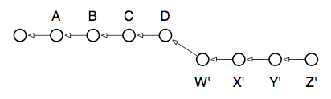
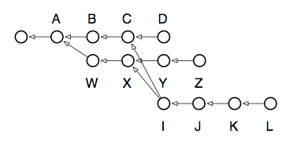

interactive-rebasing（repository）

## <a name="2-1-directory-content-tracking"></a> 2.1 代码仓库：目录内容追踪

前面已经提过，Git做的是一件很原始的事情：为目录里的内容维护一系列快照。明确了这一基本任务，要理解Git的内部设计就比较容易了。

Git代码仓库的设计很大程度上是比照着Unix文件系统的结构来的：文件系统从根目录开始展开，根目录包含其它目录，大多数目录里还包含叶节点，即文件，文件存放着数据。关于文件内容的元数据（meta-data）存储在两类位置：文件名存储在该文件所在的目录文件中；文件的大小、类型、权限等信息则存储在指向这个文件的i-node中。每个i-node都有唯一的编号，以标识它所关联的文件内容。尽管可能有多个目录项指向同一个i-node（即硬链接，hard links），但真正在文件系统上“保管”文件内容的是这个i-node。

Git的内部设计与上述结构惊人地相似，尽管有一两个关键的区别。首先，文件的内容存放在一些 _**二进制数据对象（blob）**_ 中，与文件系统中的文件类似，两者都是某种树形结构的叶节点。这种树形结构在文件系统里就是目录结构，而在Git里也是如出一辙的东西，称为树对象。接下来，正如i-node以系统分配的唯一编号作为标识，blob是以一个哈希值作为自己的文件名，即：对自身内容和大小作SHA1校验运算得到的哈希值。乍一看这就是个杂乱无章的数，跟i-node一样，但是它有两个额外的属性：第一，这个值可用于校验blob的内容不变；第二，同样的内容永远会由同样的blob来表示，无论它出现在哪儿：跨提交，跨仓库，甚至横跨互联网。如果有多棵树引用了同一份blob，就相当于做了硬链接：只要至少还有一个链接指向它，blob就不会从仓库里消失。

Git的blob和文件系统的文件有一个区别是，blob不存储关于自己内容的元数据。所有这类信息都保存在blob所在的树上。可能有一棵树认为某个blob是一个名为“foo”的、创建于2004年8月的文件，而另一棵树则把同一份blob认为是名为“bar”的文件，而且创建时间在5年之后。在正常的文件系统里，类似这样的两个内容完全相同但元信息不同的文件一定是以两个独立的文件分别存在的。为什么会有这样的区别呢？主要是因为，文件系统这样设计是为了支持文件的变化，但Git不用。Git仓库里保存的数据都是不可变的，这一特点让Git可以有不同的设计。而结果是，这一设计还使得存储空间大大节省，因为所有拥有同样内容的对象都可以共享同一份存储，不管它们出现在仓库的什么位置。

## <a name="2-2-introducing-blob"></a> 2.2 blob介绍

基本的图景已经描绘出来了，下面来看几个实际的例子。我先来创建一个Git仓库作为样例，在这个仓库里我将会自底向上地展示Git是怎么工作的。你可以一边阅读一边跟着操作：

```
$ mkdir sample; cd sample
$ echo 'Hello, world!' > greeting
```

这里我在文件系统上创建了一个名叫“sample”的目录，目录里包含一个文件，内容如你所见。此时我还没有创建代码仓库，但我已经可以开始使用Git的一些命令了，这些命令可以帮助我们理解Git要做的事情。首先，我想要知道Git会把我的greeting文本存储在哪个哈希值底下：

```
$ git hash-object greeting
af5626b4a114abcb82d63db7c8082c3c4756e51b
```

你在自己的系统上运行这个命令，会得到跟这一样的哈希值。尽管我们创建的是两个不同的代码仓库（也许相隔一个世界呢），我们各自仓库里greeting的blob对象却拥有同一个哈希值。我甚至可能从你的代码仓库拉取（pull）提交到我的仓库，那样的话Git也会识别出我们追踪的是同样的内容—因此只会为它存储一份唯一的拷贝！酷。下一步就是初始化一个新的仓库并且把这个文件提交进去。现在我先把这些工作一起完成，待会儿再回来分步骤地重新做一次，以便你看清这里头发生了什么：

```
$ git init
$ git add greeting
$ git commit -m "Added my greeting"
```

到这里，这个blob应该已经如我们所期望的在系统里边了，名字便是刚才计算得到的哈希值。为了方便，Git只要求输入哈希值的开头若干位数字，只要足够在当前仓库里唯一标识出即可。通常前面六七位就够了：

```
$ git cat-file -t af5626b
blob
$ git cat-file blob af5626b
Hello, world!
```

看，就是它！我还没有查看它属于哪个提交，或者是在哪棵树上，但是仅从内容来看已经足以断定它在那儿了，而它确实在。不管这个仓库存在了多长时间，也不管这个文件在仓库里什么位置，它的id永远会是这个值。这份内容已经被永久地保存起来了，并且是可以验证的。

如此，Git里用blob来表示最基本的数据单元，而整个系统实际上就是关于blob的管理。

## <a name="2-3-blobs-are-stored-in-trees"></a>2.3 blob存储在树对象中

你的文件内容存储在blob里，但这些blob基本没什么特征。没有文件名，没有结构—毕竟它们只是“二进制对象”。

为了表示出文件的组织结构和命名，Git把blob作为叶子挂到树对象上。现在我单凭查看这个blob是找不出它挂在哪棵树（或哪些树）上的，它可能有很多很多所有者。但我可以确定的是，在我刚才所做的提交里的某个位置一定有它：

```
$ git ls-tree HEAD
100644 blob af5626b4a114abcb82d63db7c8082c3c4756e51b greeting
```

找到啦！刚才的初次提交已经把greeting文件添加到仓库里了。这个提交对象包含了一棵Git树，该树对象有唯一一个叶节点：greeting内容的二进制数据对象（blob）。

虽然我通过给ls-tree传入HEAD参数就能看到这棵树包含着我的blob，但我还没看见这个树对象本身，以及它是怎么被提交对象引用的。这里有另外几个命令可以显明这些区别，并且发现这棵树：

```
$ git rev-parse HEAD
588483b99a46342501d99e3f10630cfc1219ea32 # 你的系统上会得到不同的结果
 
$ git cat-file -t HEAD
commit
 
$ git cat-file commit HEAD
tree 0563f77d884e4f79ce95117e2d686d7d6e282887
author John Wiegley <johnw@newartisans.com> 1209512110 -0400
committer John Wiegley <johnw@newartisans.com> 1209512110 -0400
Added my greeting
```

第一个命令反向解析出HEAD别名所引用的提交对象，第二个命令查看其类型，第三个命令展示了该提交底下的树对象的哈希值，以及存储在提交对象中的其它信息。我这个提交对象的哈希值是与你不同的—因为里面包括我的名字、提交日期等信息—但我们的树对象的id应该是一样的，因为它包含着同样内容、同样名字的文件的blob。

我们再来验证一下这个树对象与刚才用ls-tree HEAD查看的确实是同一个：

```
$ git ls-tree 0563f77
100644 blob af5626b4a114abcb82d63db7c8082c3c4756e51b greeting
```
看见了吧：我的仓库里包含独一的提交对象，它引用了一个树对象，树对象包含一个blob对象—blob里面就是我想要记录下来的内容。我还可以运行一个命令来验证这个事情：

```
$ find .git/objects -type f | sort
.git/objects/05/63f77d884e4f79ce95117e2d686d7d6e282887
.git/objects/58/8483b99a46342501d99e3f10630cfc1219ea32
.git/objects/af/5626b4a114abcb82d63db7c8082c3c4756e51b
```

这一输出告诉我：我的整个repo里面包含3个对象，它们对应的哈希值正是前面几个例子里出现的那些。最后我们再来看一眼这些对象分别是什么类型，满足一下好奇心：

```
$ git cat-file -t 588483b99a46342501d99e3f10630cfc1219ea32
commit
$ git cat-file -t 0563f77d884e4f79ce95117e2d686d7d6e282887
tree
$ git cat-file -t af5626b4a114abcb82d63db7c8082c3c4756e51b
blob
```

到这儿我其实可以用show命令来查看各个对象的内容概览。不过还是作为练习留给读者吧。

## <a name="2-4-how-trees-are-made"></a> 2.4 树对象如何生成

每个提交对象拥有且仅有一棵树，不过树是如何生成的？我们知道blob的创建是通过把文件的内容填入二进制对象中—而树可以拥有blob—但我们还没看见承载blob的树是怎么造出来的，也没看见树是怎样与其父提交对象链接起来的。

我们重新来创建一个样例仓库，但这次要一步一步地手工操作，好让你切实感受到这底下究竟发生了什么：

```
$ rm -fr greeting .git
$ echo 'Hello, world!' > greeting
$ git init
$ git add greeting
```

一切都从你第一次向索引里添加文件开始。我们先这么说，索引是你用于从文件创生出blob的一个地方。在我刚才添加（add）greeting文件的时候，我的仓库里就产生了一个变化。我暂时还看不到有任何提交，但有个办法能告诉我发生了什么：

```
$ git log # 该命令会报错，因为尚未做过提交
fatal: bad default revision 'HEAD'
$ git ls-files --stage # 列出当前索引（即暂存区）里引用的blob
100644 af5626b4a114abcb82d63db7c8082c3c4756e51b 0 greeting
```

这是啥？我什么都还没提交，但这儿已经有一个对象生成了。它的哈希值跟我最最开始得到的那个值是一样的，因此我知道它代表着我的greeting文件的内容。这里我可以用cat-file -t来查看这个对象的类型，会发现它是一个blob。事实上，它就是跟我最开始的样例仓库里得到的那个blob一模一样。同样的文件一定会得到同样的blob（总担心强调得不够）。

这个blob目前还没有被哪棵树引用，也不属于任何一个提交对象。此时此刻只有一个东西引用了它，那就是.git/index文件。这就是我们的索引文件，它引用着那些组成当前索引的blob对象和树对象。那么，现在我们就来造一棵树，好把我们的blob挂上去：

```
$ git write-tree # 将当前索引的内容写入一棵树
0563f77d884e4f79ce95117e2d686d7d6e282887
```

这个值应该也挺眼熟：包含同样blob（以及子树）的树，永远会有同样的哈希id。我现在还没有提交对象，但仓库里已经有一棵挂着我们blob的树对象了。write-tree这个底层命令的作用是，把索引文件里的无论什么内容，全塞进一棵新的树里，以用于创建提交对象。

直接使用这个树对象，我就能手动造出一个提交对象了，这正是commit-tree命令所做的事情：

```
$ echo "Initial commit" | git commit-tree 0563f77
5f1bc85745dcccce6121494fdd37658cb4ad441f
```

commit-tree同样是底层命令，它以树对象的哈希id作为入参，生成一个提交对象来持有这棵树。如果希望该提交有一个父提交，需要用-p选项把父提交的哈希值传给它。同时，请注意这里出现的哈希值跟你机器上的不一样：这是因为我的提交对象包含了我的名字和我创建提交的日期，这两个细节信息一定是与你的不同的。

活儿还没干完呢，因为我还没有把这个提交登记为某个分支的新头部（head）：

```
$ echo 5f1bc85745dcccce6121494fdd37658cb4ad441f > .git/refs/heads/master
```

该命令告诉Git：名为“master”的分支现在应该指向这个最新的提交了。不过，另一个更加安全的做法是用update-ref命令：

```
$ git update-ref refs/heads/master 5f1bc857
```

创建好master分支以后，我们还须要把它跟当前工作树关联起来。正常来说这件事情是在你检出（checkout）一个分支的时候发生的：

```
$ git symbolic-ref HEAD refs/heads/master
```

这个命令把HEAD符号指针与master分支关联起来了。这个很重要，因为将来从工作树发出的任何提交都可以自动更新refs/heads/master的值了。

啊，难以置信整件事情我们已经做完了，就这么简单。现在我可以用log命令查看我亲手铸就的提交对象了：

```
$ git log
commit 5f1bc85745dcccce6121494fdd37658cb4ad441f
Author: John Wiegley <johnw@newartisans.com>
Date:   Mon Apr 14 11:14:58 2008 -0400
        Initial commit
```

解释一下：如果我没有设置refs/heads/master让它指向这个新提交，那么它是“够不着的”，因为没有任何东西指向它，并且它也不是任何一个“可触及的”提交的父提交。如果出现这种情况了，这个提交对象会在某个时候被系统从仓库里移除，同时它所持有的树以及树上的所有blob都会被移除。（这件事情是由一个名为gc1的程序自动完成的，该命令基本上不需要你手动执行）。通过把提交对象与refs/heads里的一个名字链接起来，就像我们刚才所做的，它就成为一个可触及的提交了，这样就确保了从现在起它会被好好保存的。

## <a name="2-5-the-beauty-of-commits"></a> 2.5 提交之美

有些版本管理系统把“分支”做成了有点魔性的东西，通常把它们跟“主线”或者“树干”明显区分开来，要不就是把“分支”的概念说得好像跟提交非常不一样。然而在Git里，并没有分支这种专门的实体：有的只是blob对象、树对象和提交对象。由于提交对象可以有一个或多个父提交，这些父提交还可以有父提交，这种组织关系使得一个单独的提交就可以被看作一个分支：因为它可以回溯得到造成这个提交的全部历史信息。

你随时可以查看所有在顶层（top-level）被引用的提交，用branch命令：

```
$ git branch -v
* master 5f1bc85 Initial commit
```
来跟我一起念：分支不是别的，它仅仅是对某个提交对象的命名引用。在这个意义上，分支与标签是等价的，唯一的区别是标签可以带有描述信息（正如提交可以带有描述信息）。分支仅仅是名字，而标签则是描述性的，呐，“标签”嘛。

但事实是，别名完全不是必需品。举个例子，如果我愿意，我只要拿到提交对象的哈希值就可以索引出仓库里的所有东西了。好，我直接来个最机车的，把工作树的HEAD重置到某个特定的提交：

```
$ git reset --hard 5f1bc85
```
--hard选项的意思是，清除工作目录里现有的所有改动，无视它们是否已登记为待检入的内容（后文会详细介绍该命令）。同样这件事更安全的做法是用checkout：

```
$ git checkout 5f1bc85
```
区别是工作目录里改动过的文件会被保留。如果给checkout加上-f选项，在这个例子里就跟reset --hard的行为一样了，除了checkout仅仅改变工作树，而reset --hard还会改变当前分支的HEAD，让它指向指定的那个版本。

这个基于提交的系统（commit-based system）还有个令人愉悦的地方：哪怕你遇到最复杂的情形，你也可以避开那些繁复的版本管理术语了，现在只用最简单的词汇就能表述。比如，如果一个提交有多个父提交，那么这是一个“合并提交（merged commit）”—因为它把多个提交合并为一个。还有，如果一个提交有多个孩子，就意味着它是某个“分支”的祖先（ancestor），等等。对Git来说这些东西还真没什么区别：整个世界不过是一系列提交对象的集合，每个提交对象持有一棵树，树又指向其它的树和blob对象，blob存储着你的数据。任何比这更复杂的都不过是一些所谓命名系统做的事情了。

下面这幅图展示这些碎片是怎么组合到一起的：


## <a name="2-6-a-commit-by-any-other-name"></a> 2.6 提交有哪些别名？

理解提交是掌握Git的关键。当你脑子里只有提交的拓扑结构，而把那些让人困惑的分支啦、标签啦、本地和远端仓库啦，等等统统抛开的时候，你就知道你已来到智慧的禅之高原啦。好在这种程度的理解不需要你自断手臂。。。不过你若正在考虑的话我觉得你很可以。

如果提交是钥匙，那怎么其称呼方式就是通往大师水平的门道了。有很多很多方法来称呼某个提交、某个范围内的提交、甚至提交底下的某些对象。这些名称能被绝大多数的Git命令接受。这里总结了一些最基本的：

**分支名** — 前面已经说了，分支的名字只不过是该“分支”上最近一次提交的别名。用这个称呼跟该分支检出时候的HEAD效果是一样的。

**标签名** — 标签别名与分支别名，在“指代”一个提交的时候，两者是等价的。两者的主要区别在于，标签别名永远不变，而分支别名在每次该分支有新提交检入时会跟着改变。

**HEAD** — 当前检出的提交永远叫作HEAD。如果你检出了一个特定的提交—而不是一个分支名—那么HEAD就仅仅指向该提交而不指向任何分支。注意这是一个比较特殊的情况，也称为“使用游离的HEAD”（我敢说此处应有一个笑话...）1。

**c82a22c39cbc32...** — 一个提交永远可以用它自己的40位完整SHA1哈希id来指代。这通常只在复制粘贴的时候用到，因为一般都会有别的更方便的方法来指代同一个提交。

**c82a22c** — 你只需要用哈希id的前几位就可以了，位数足以在仓库里唯一标识出你要的东西就行。大部分时候六到七位足够了。

**name^** — 用尖号表示任一提交的父提交。如果某个提交有不止一个父提交，尖号索引的是第一个。

**name^^** — 尖号可以叠加使用。该别名指向给定名字的提交的“父亲的父亲”。

**name^2** — 如果一个提交有多个父提交（比如合并提交），你可以用name^n来指代第n个父提交。

**name~10** — 一个提交的第n级祖先可以用波浪号（~）接一个序号来表示。这类名称在rebase -i命令里很常用，比如，“给我看最近的一连串提交”。该别名同name^^^^^^^^^^。

**name:path** — 要指代一个提交所持有的树里的某个特定文件，可以在冒号后面指定（带完整路径的）文件名。这在show命令里很有用，或者用来展示一个文件在两个已提交版本之间的diff：
```
$ git diff HEAD^1:Makefile HEAD^2:Makefile
```

**name^{tree}** — 你可以直接引用提交所持有的树，而非提交本身。

**name1..name2** — 这个别名和下一个都是用来指代提交范围（commit ranges）的，它们在类似log的命令中相当有用，可以查看某个特定的时间区间里发生了什么。该语法指代的是，从name2回溯到（但不包含）name1，中间所有可触及的提交。如果省略name1或者name2，省略处自动以HEAD替代。

**name1...name2** — “三连点”表示的范围不同于上面的两点版本。对于像log这样的命令，它指向name1或者name2两者引用的所有的提交的集合，但去掉两者同时引用的那些。它的结果是这两个分支里各自独有的提交。对于像diff这样的命令，该范围表示的是从name2到name1与name2的公共祖先之间的那些提交。这与log的区别是，由name1引入的改动不会显示出来。

**master..** — 等价于“master..HEAD”。虽说前面的例子已经包含这种情况了，我还是把它加到这儿，因为我自己长期使用这类别名来查看当前分支上的改动。

**..master** — 和上面类似，当你刚完成一次fetch、想查看你上次rebase或merge之后发生了哪些变化的时候，这个别名就非常有用。

**--since="2 weeks ago"** — 指向某个日期起往后的所有提交。

**--until="1 week ago"** — 指向截止到某个日期往前的所有提交。

**--grep=pattern** — 指向提交信息与正则表达式匹配的所有提交。

**--committer=pattern** — 指向提交者（committer）匹配正则表达式的所有提交。

**--author=pattern** — 指向作者（author）匹配正则表达式的所有提交。提交的作者是指创建本次提交中的改动的那个人，对于本地开发这个人就是提交者，但如果是在通过电子邮件发送补丁（patches）的时候，“作者”与“提交者”通常是不同的人。

**--no-merges** — 指向所有只有一个父提交的提交，即忽略所有合并提交。

以上大部分选项都可以组合搭配使用。下面这个例子用来查看满足如下条件的所有日志条目：过去一个月之内，由我自己在当前分支（从master分出来的一支）上做的改动，且提交信息中包含“foo”：

```
$ git log --grep='foo' --author='johnw' --since="1 month ago" master..
```

## <a name="2-7-branching-and-the-power-of-rebase"></a> 2.7 分支，以及rebase的力量

Git里最为强悍的、用于操作提交对象的命令之一，是有着很不起眼的名字的rebase（变基）命令。从根本上讲，你开发的每个分支都有一个或多个“基础提交（base commit）”，它们是分支开始生长的位置。下图是一个很典型的场景。注意箭头是往时间更早的方向指的，因为每个提交引用着自己的父提交，而非子提交。因此，图中D和Z两个提交代表着各自分支的头部：


在本例中，运行branch命令会列出两个“头”：D和Z，而两个分支的共同祖先是A。show-branch命令展示的正是上图所示的信息：

```bash
$ git branch
  Z
* D
 
$ git show-branch
! [Z] Z
 * [D] D
--
 * [D] D
 * [D^] C
 * [D~2] B
+  [Z]Z
+  [Z^]Y
+  [Z~2] X
+  [Z~3] W
+* [D~3] A
```

阅读该输出需要习惯一下，不过本质上它跟上面的示意图没有区别。它告诉我们以下信息：

当前所在分支最初的分叉点是提交A（也叫D~3，你非要叫它Z~4也行）。注意语法commit^指向commit的父提交，而commit~3指向它的第三代父亲，也就是曾祖父。

从底下往上看，左起第一列（那几个加号）表示一个分支Z，分支上有四个提交：W，X，Y，Z。

第二列（那几个星号）表示当前分支上的提交，也就是B，C，D这三个。

输出的顶部—以分割线与底下隔开的部分，标出了各个分支名，以及各分支的提交分别由哪一列的哪个字符作为标记。

现在我想要做一件事情：让分支Z重新跟上D的进度。换句话说，我们希望把B，C，D完成的工作同步到分支Z中。

在别的版本控制系统里类似的事情只能用“分支合并”的方法来完成。在Git里用merge命令也可以实现分支合并。如果Z是一个已经发布出去的版本，我们不想改变其提交历史，这种时候就必需用到merge：

```
$ git checkout Z # 切换到分支Z
$ git merge D # 合并B，C，D的内容到Z中
```
执行之后，代码仓库变成这样：



现在如果再检出Z分支，它就已经包含了之前的Z（现在应表示为Z^）与D的内容合并后的结果。（但要注意：现实中的merge操作如果D和Z有冲突的话，系统会要求先解决冲突）。

现在新的Z已经包含D带过来的改动了，但现在出现了一个新的提交对象专门代表Z与D的合并：即当前表示为Z’的提交。这个提交没有添加任何新东西，仅仅表示完成了把D与Z合并到一起这件事。某种意义上说它是一个“元提交（meta-commit）1”，因为它的内容仅仅与代码仓库内部完成的事情有关，并不涉及到工作目录里任何新的工作。

不过，有一个办法可以把Z分支直接移栽到D上，有效地让它在时间轴上前移：用我们强大的rebase命令。下图是我们的目标：



图示的形态最直观地表明了我们想要完成的事情：我们本地正在开发的Z分支，要让它变成是基于主分支D的最新版本演变而来的。所以该命令叫做rebase（变基），因它改变的是分支最早开始派生的基础提交位置。如果反复运行该命令，你会不断得到一些补丁，它们一定是主分支的最新版本的补丁，而且不会给你开发中的分支添加不必要的合并提交。下面是要运行的命令，请与前面的merge操作进行对比：

```
$ git checkout Z # 切换到Z分支
$ git rebase D # 将Z的基础提交变为D
```
为什么该操作只适用于本地分支？因为你每次rebase，都有潜在的可能会改变该分支里的每一个提交。之前，W是基于A的，它里面只包含从A到W的变换。然而在变基之后，W会被重写，以保证它包含所有从D到W’需要的变换。更甚，从W到X的变换也变了，因为刚才的A+W+X现在是D+W’+X’了—如此等等。假如该分支对其他人也可见，而且任何一个下游用户从Z上派生出了他自己的本地分支，那他们的分支现在还指向旧的Z，而不是新的Z’。

一般来说，应当遵循这个铁律：如果是本地分支、且该分支上没有别的分杈，就用rebase，其它情况都用merge。此外merge还在你要把本地分支pull进主分支的时候有用。


## <a name="2-8-interactive-rebasing"></a> 2.8 交互式rebase

上面的例子里运行rebase的时候，它自动重写从W到Z的所有提交，以保证Z分支变成以提交D（即分支D的头部）为基准的分支。不过，该重写过程你是可以全权操控的。如果给rebase命令加上-i选项，系统会弹出一个编辑窗口，让你选择对本地Z分支的每个提交分别做什么操作：

选中（pick）—这是默认行为，如果不进入交互模式的话每个提交都选这个。它表示当前询问的提交对象需要以它的（已重写的）父提交作为基准来重写。对每个有冲突的提交，rebase命令会提供机会让你解决冲突。

挤压（squash）—“挤压”一个提交将把它的内容“折叠”进它的前面一个提交里。可以对多个提交进行挤压。还用上面的例子，如果你挤压所有提交（第一个除外，第一个必须被选中，后面的才能挤压），那么得到的新的Z分支就只包含一个提交，从D长出来。适用于你的改动分散在多个提交里、但你希望改写提交历史让这些改动都放在一个提交里的情况。

编辑（edit）—若你把某个提交标记为编辑，rebase程序会在该提交处中断，把当前工作树设置为该提交产生时的情形，并且把shell交给你。索引文件中已经注册上了你运行commit时需要包含的所有改动。这样你就可以改变任何你想改变的东西：修正某个改动，撤销某个改动，等等；提交之后，再运行rebase --continue来继续，该提交就已改写完成，看起来就跟最初就是这样提交的一样。

（抛弃）(drop)—如果你在rebase交互模式的文件中把一个提交移除了，或是注释掉了，很简单，这个提交就消失了，就像从来没提交过一样。注意这可能会引起merge冲突，如果你后面有的提交依赖于这些改动的话。

你很难一开始就欣赏该命令的强大能力，但它已经赋予了你对任一分支形状的无限的掌控能力。你可以用它来：

把多个提交缩合为一个提交。

给提交重新排序。

当你后悔了，移除错误的改动。

把分支的基点更改为代码仓库中的任一提交。

修改个别提交，在事情发生很久之后修正当时的改动。

推荐大家现在阅读一下rebase的手册（man page），里面有几个很好的例子，告诉你如何释放出这匹猛兽的真正力量。最后再让你感受一下它的潜力，请看下面这个场景，想一想如果有一天你想把分支L迁移到Z上变成Z的新头部，你会怎么做：



上图可以这样来看：我们的开发主线是D，在D往前推三个提交的时候开启了一个尝试性的分支，即现在的Z。在这期间的某个时候，当时C和X分别是它们各自分支的头部，这时我们决定启动另一个尝试性分支，即后来的L。现在我们发现L的代码挺好的，但还不足以合并到主线上，于是我们决定把L上面的改动转移到正在开发的分支Z上，让整个改动看起来像是在同一个分支上完成的。噢，我们还想快速地编辑一下J，改一下版权日期就好，因为之前做改动的时候忘了时间是2008！下面的命令帮助我们解开这个结：

```
$ git checkout L
$ git rebase -i Z
```
可能需要处理一些冲突。最后我们的仓库变成了这样：


看到了吧，只要是本地开发，rebase让你有无限的控制权，完全地掌控你的提交在仓库里呈现的样子。
