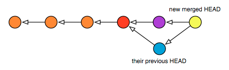

# 4 重置（reset）

## <a name="4-1-to-reset-or-not-to-reset"></a> 4.1 重置，还是毁灭？

Git里面最难掌握的命令之一就是`reset`（重置），它烦人的频度似乎比别的命令都要高。这也是可以理解的，毕竟它有潜在的可能同时改变当前工作树和当前的HEAD指向。因此我想对这个命令作一个简述，应该会有所帮助。

本质上讲，`reset`是一个指针编辑器，索引编辑器，以及工作树编辑器。这已经够让人困惑的了，它居然能做这么多事。下面我们仔细看看这三种模式有什么区别，以及它们是如何恰到好处地组装进Git的提交模型的。

## <a name="4-2-doing-a-mixed-reset"></a> 4.2 混合重置

如果用--mixed选项（或者不提供选项，这就是默认选项），reset命令会将索引中的部分内容连同HEAD指针一起进行恢复操作，以匹配给定的提交。与--soft的主要区别是，--soft只改变HEAD的指向，不碰索引。

```
$ git add foo.c  # 把改动添加到索引，产生新的blob
$ git reset HEAD  # 删除索引里所有已登记的内容
$ git add foo.c  # 刚搞错了，重新加上
```

## <a name="4-3-doing-a-soft-reset"></a> 4.3 软重置

如果用--soft选项来reset，就相当于单纯改变了一下HEAD，让它指向另一个提交。工作树不会变。也就是说下面这两个命令是等价的：

```
$ git reset --soft HEAD^     # 把HEAD重置到其父提交，
                             # 效果等于忽略上一次提交
```

```
$ git update-ref HEAD HEAD^  # 跟上面一样，不过是手动地
```
这两个例子里，你的工作树现在都是基于更老的HEAD了，如果现在运行status你会看到有更多的改动。你的文件并没有变，只不过现在是跟更老的版本做比较。相当于给了你机会创建新的提交，以替换掉刚才那个。不过如果你想修改的是最近一次签入的提交，用commit --amend就可以把最新的改动追加进去，效果就跟一次完成的一样。

但请注意：如果你还有下游开发者，且他们已经基于你的上一个HEAD — 你扔掉的那个 — 做了一些工作了，那这种对HEAD的改变会导致他们下一次拉取（pull）之后自动发生一次合并（merge）。下图显示你的工作树在经过软重置和新提交之后将呈现的样子：


以及你的下游开发者在下次拉取之后HEAD的样子，请注意颜色的变化：



## <a name="4-4-doing-a-hard-reset"></a> 4.4 硬重置

进行硬重置（--hard选项）有很大的潜在风险，因它有能力同时做两件不同的事情：首先，如果你往当前HEAD上进行硬重置，你工作目录里的所有改动都会被擦除，以保证当前的文件与HEAD的内容完全匹配。

有另一个命令，checkout（检出），在索引为空的情况下，它做的事情与reset --hard是一样的。索引若不为空，则强制让工作树匹配索引。

接下来，如果你想硬重置到某个更早的提交，就相当于先做一次软重置，随后用reset --hard来重置工作树。因此下面两组命令互相等价：

```
$ git reset --hard HEAD~3  # 时间倒回，扔掉中途的所有变动
```

```
$ git reset --soft HEAD~3  # 让HEAD指向早先的某个提交
$ git reset --hard  # 抹掉所有差异，使工作树与HEAD保持一致
```

如你所见，硬重置是极具破坏性的。幸运的是，有更安全的办法可以达到同样的效果，用的是Git的stash（储藏）命令（见下一章）：

```
$ git stash
$ git checkout -b new-branch HEAD~3   # 回到过去了！
```

这样做有两大优势，如果你不确定是否真的想修改当前分支的话：

你的当前工作都被储藏到栈上了，你随时可以重新应用它。注意储藏栈是分支无关的，你可以在某个分支上储藏工作树状态，随后把它应用到别的分支上去。

你的工作树恢复到某个过去的状态了，但是是在新创建的分支上恢复的。如果你决定要在该状态的基础上继续提交改动，那也不会影响到你原来的分支。

如果你在新分支new-branch上做了一些改动，并且后来决定用它作为新的主分支，可以运行下面的命令：

```
$ git branch -D master  # 拜拜，旧的主分支（仍保留在reflog中）
$ git branch -m new-branch master  # new-branch现在成为主分支了
```

这个故事的精髓在于：虽然你可以在当前分支上动大手术，用reset --soft或是reset --hard（后者会改变工作树），但你为什么想这样呢？Git已经有分支操作了，既简单，代价又小，把有破坏潜力的修改放到分支上去做，几乎永远是值得的。何况后面还可以用这个分支替代原来主干的位置。分支的方式几乎有着绝对吸引力...

那如果你不小心运行了reset --hard，不光丢失了当前的改动，连同主分支上的几个提交也一起丢失了呢？呃，除非你养成了用stash随时保存的习惯（见下一章），否则你无论如何也不能恢复刚才丢失的工作树了。但是，你的分支还可以恢复到它的上一个状态，方法是再用一次reset --hard，往reflog（索引日志）上做硬重置（相关内容下一章还会解释）：

```
$ git reset --hard HEAD@{1}   # 通过reflog恢复到上一次操作之前
```

安全起见，坚决不要在未运行stash的情况下使用reset --hard。遵循这一点会为你日后省下很多白发的。如果你之前做过储藏，现在你就能用它来恢复工作树了：

```
$ git stash  # 多多保存总是好的
$ git reset --hard HEAD~3  # 时光倒流
$ git reset --hard HEAD@{1}  # 糟糕, 弄错了，需要撤销！（恢复HEAD）
$ git stash apply  # 并且恢复工作树已有的改动
```
